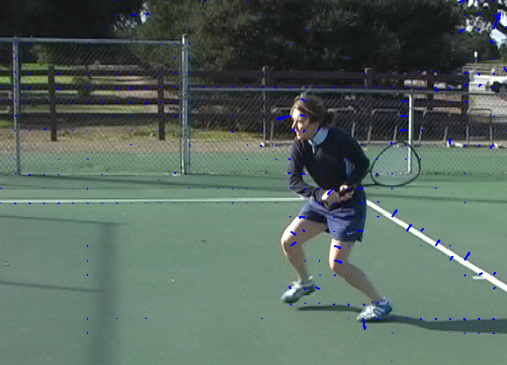
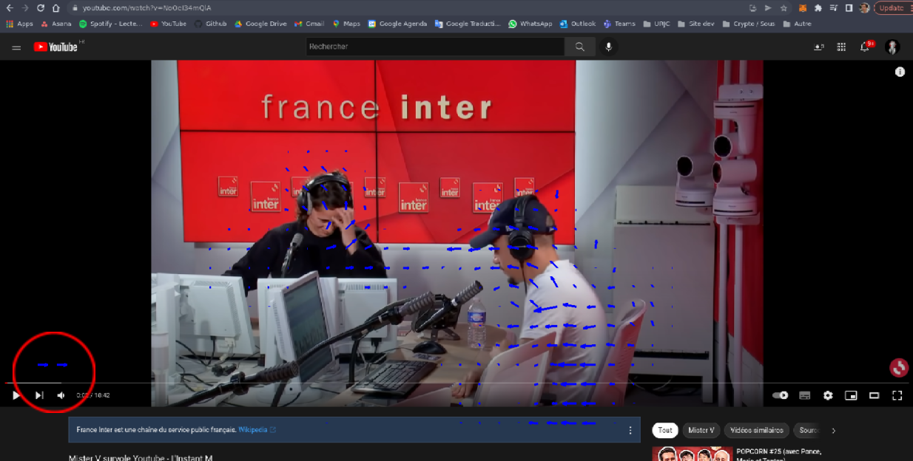
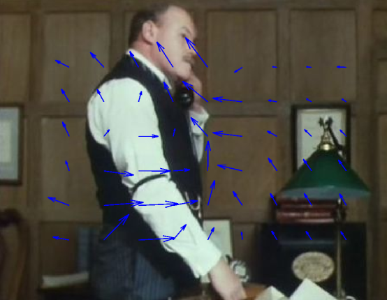

# Optical flow - Lucas Kanade - Horn & Schunck

Optical flow using Lucas Kanade and Horn & Schunck methods

#### 👨‍🎓 This project was carried out during my master's degree in computer vision at URJC - Madrid

## Goals

- Find the optical flow with Lucas Kanade method
- Find the optical flow with Horn & Schunck method

## Requirements

* Matlab

###### More explanations in ```docs/explanations_esp.pdf``` (only in spanish)

## Usage

Just run ```main_lucaskanade.m``` or ```main_horn_schunk.m``` in matlab

## Example

<p align="center">
  
</p>
<p align="center">
  <i>Example 1</i>
</p>

<p align="center">
  
</p>
<p align="center">
  <i>Example 2</i>
</p>

<p align="center">
  
</p>
<p align="center">
  <i>Example 3</i>
</p>

## Structure

    .
    ├── data
    │    └── *.jpg
    ├── docs
    │    └── explanations_esp.pdf
    ├── imgs
    │    ├── Ex_1.png
    │    ├── Ex_2.png
    │    └── Ex_3.png
    ├── README.md
    └── src
        ├── choose_image.m
        ├── get_derivatives.m
        ├── main_horn_schunk.m
        └── main_lucaskanade.m

## Authors

* **Luis Rosario** - *Member 1* - [Luisrosario2604](https://github.com/Luisrosario2604)